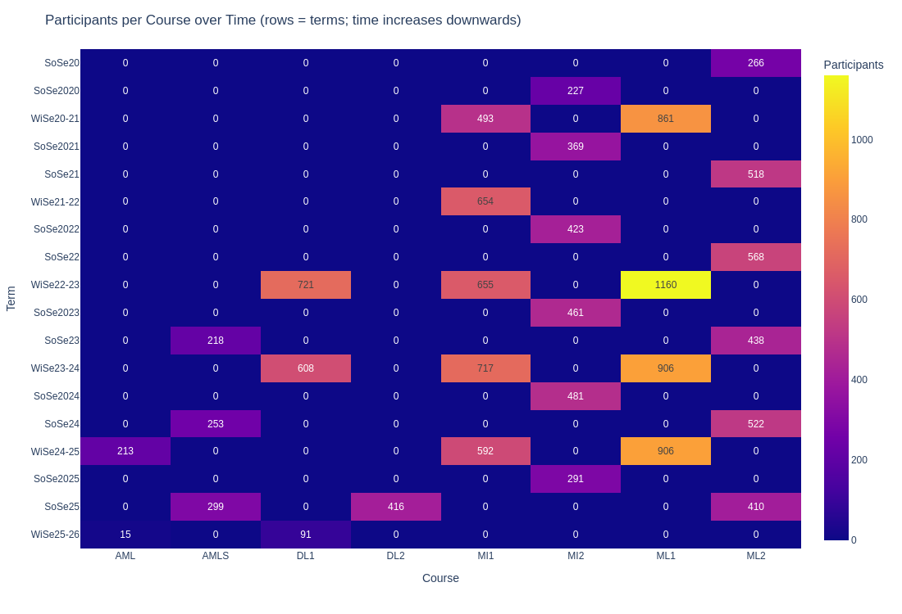
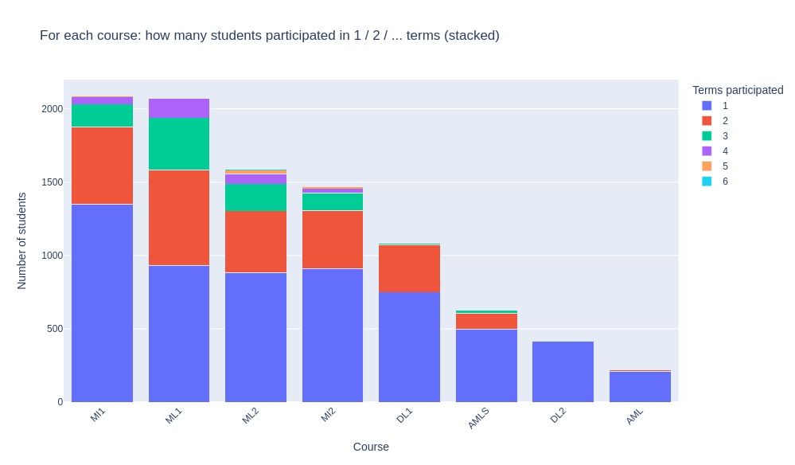
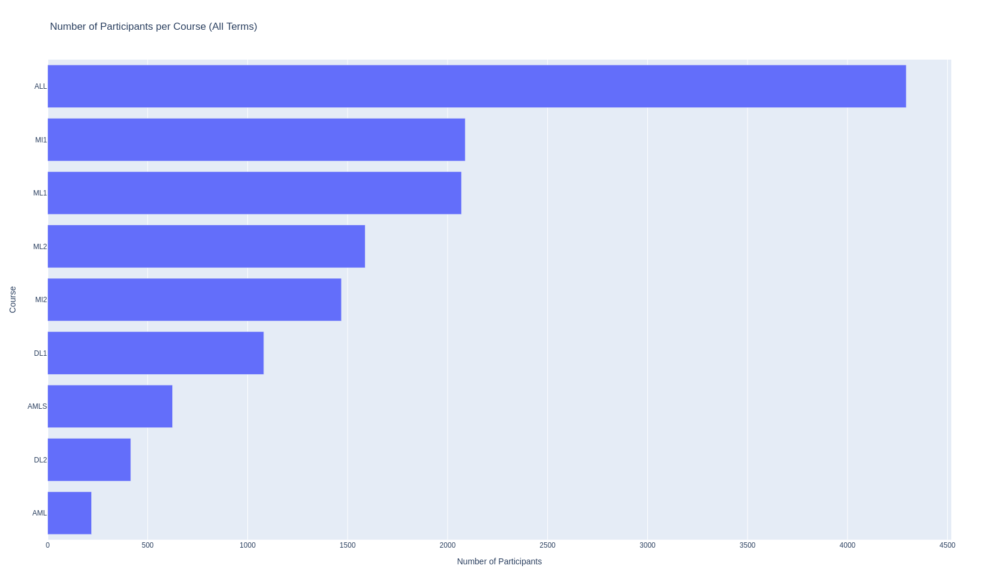
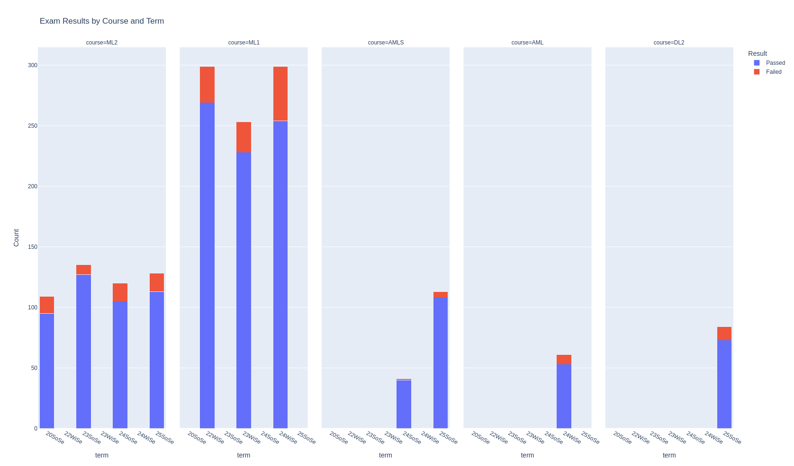
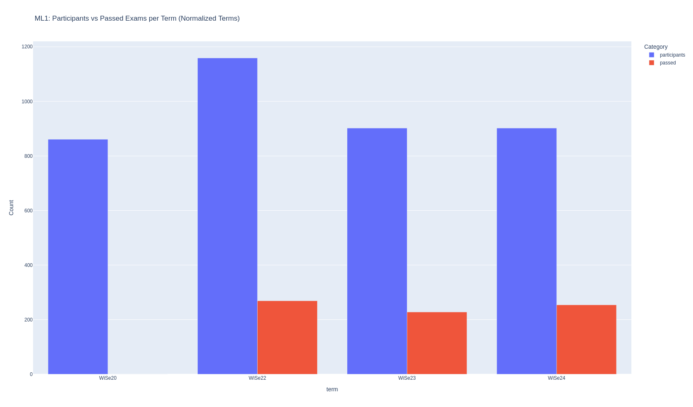
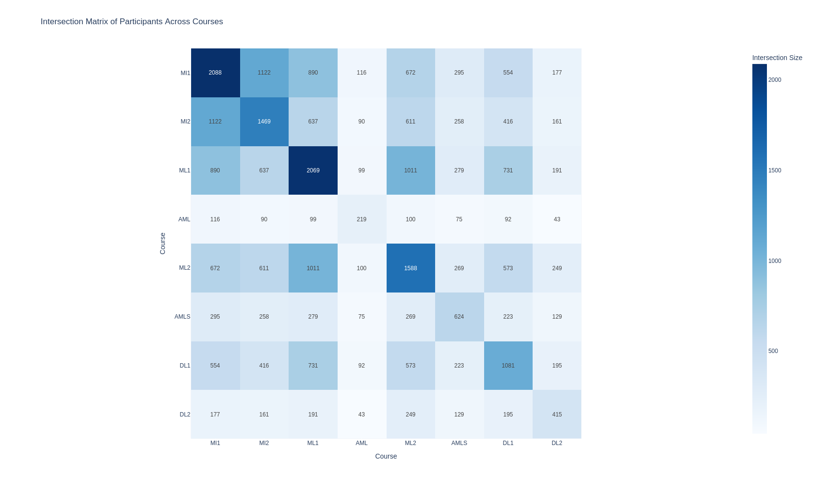
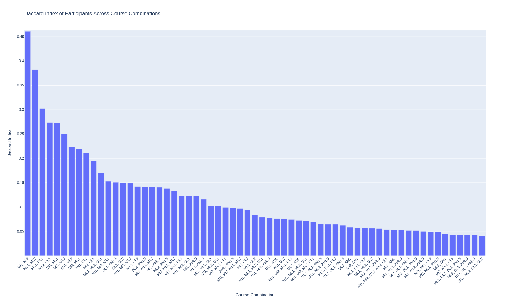
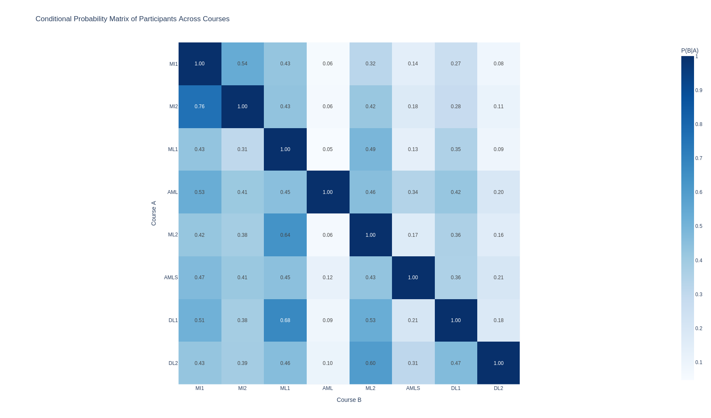

# Project AI Learning Paths

The aim of this project is to identify the common learning paths students choose to learn about AI at TU Berlin.
Data got collected manually from the learning platform ISIS (9.2025) and the oldest term goes back to 2020.

Each module defines some learning goals.
All courses are implementing a module for a given term.
On the learning platform ISIS, students can enroll in such courses.
If a student enrolles into a course, the first and last name of that student are noted on that courses participation list.
This entry is removed if the student leaves the course.
Many students don't leave courses.
Technically, students can enroll themselves in any course.
Therefore, the number of participants can be higher in comparision to the number of successful exams.
Data about exams is very limited though.
Typically, students dont participate in modules while missing major prerequisites for that module.

For the following modules, we collected the participation lists of all available releated courses.  
Then, for each module we constructed a set of participants over all lists.
We analyzed these sets.
All collected data has been encrypted to ensure no personal information is leaked.

- Machine Intelligence 1 (MI1, 5 terms)
- Machine Intelligence 2 (MI2, 6 terms)
- Machine Learning 1 (ML1, 4 terms)
- Machine Learning 2 (ML2, 6 terms)
- Deep Learning 1 (DL1, 3 terms)
- Deep Learning 2 (DL2, 1 term)
- Adversarial Machine Learning (AML, 1 term)
- Architecture of Machine Learning Systems (AMLS, 3 terms)

Participants can enroll themself in multiple courses of the same module.

Below are further results.

## Visualizations

### Number of participants by Module

Machine Intelligence 1, Machine Learning 1 and Machine Learning 2 have the highest participation.

### Exam Results by Course

Available exam data. Students may failed multiple exams but can only pass an exam once. 

### Participation vs Passed Exames

For the first term of ML1, no exam data was available. 
Participation is 3.6-4.3 times highest than the number of passed exams.

### Combination Matrix

The largestes intersections in participation are: (MI1, MI2, 1122), (ML1, ML2, 1011), (MI1, ML1, 890), (ML1, DL1, 731), (MI1, ML2, 672).

### Jaccard Index of Module Combinations

The top 5 modules with highest number of interescting participants are: (MI1, MI2, .46), (ML1, ML2, .38), (ML1, DL1, .3), (ML2, DL1, .27), (MI1, ML1, .27).

### Conditional Probability Matrix

Students in MI2 also participate with a probability of 76% in MI1. 
Whereas someone in MI1 has only a probability of 54% for participating in MI2.
Less than 7% of students in either MI1, MI2, ML1 or ML2 are participating in AML. 

Every seconds ML1 student is enrolled in ML2 and every thrid ML1 studen is enrolled in DL1.
But only 9% of ML1 students are enrolled in DL2.

The highest probabilities are: (MI2, MI1, 76%), (DL1, ML1, 68%), (ML1, ML2, 64%).

# Conclusion
In total there are almost 4300 different participants.
Almost 50% of participants are enrolled in MI1. 
Another 50% of participants are enrolled in ML1.  
The most popular course combinations are: (MI1, MI2), (ML1, ML2) and (ML1, DL1).
Only 25% of participants of ML1 do actually pass the exam.
Nevertheless every second ML1 students is enrolled in ML2.  

